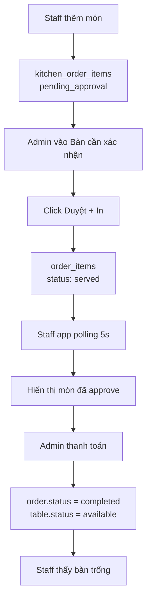
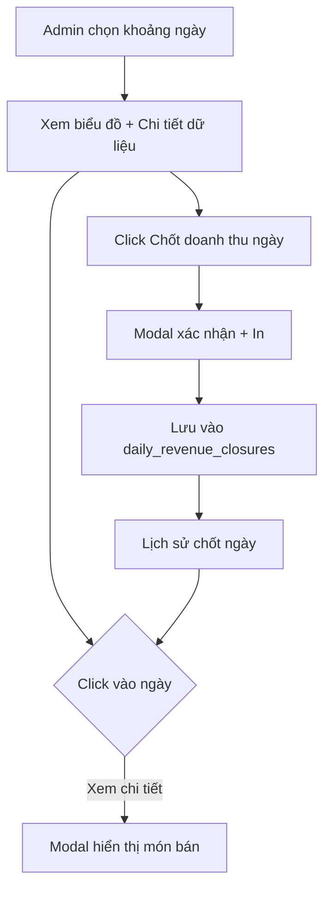

# 🍽️ Restaurant Management System

Hệ thống quản lý nhà hàng hoàn chỉnh với Admin Panel (Web) và Staff App (Android).


---

## ✨ Tính năng chính

### 🖥️ Admin Panel (Web)
- ✅ **Dashboard**: Quản lý bàn real-time, thanh toán, KPI
- ✅ **Quản lý bàn**: CRUD tables, phân khu vực, pagination
- ✅ **Quản lý món ăn**: CRUD menu items với categories
- ✅ **Quản lý nhân viên**: Tạo tài khoản với roles (admin/manager/waiter/kitchen)
- ✅ **Bàn cần xác nhận**: Approve món staff thêm, in phiếu bếp, badge count
- ✅ **Báo cáo doanh thu**: Charts, filter theo ngày/tháng/bàn/món, drill-down
- ✅ **Chốt doanh thu ngày**: Modal xem món bán, in tổng hợp, lưu lịch sử

### 📱 Staff App (Android)
- ✅ **Xem danh sách bàn**: Grid view, filter status/area
- ✅ **Thêm món cho khách**: Search menu, add to order
- ✅ **Xem order hiện tại**: Hiển thị món confirmed + pending riêng biệt
- ✅ **Auto-refresh**: Polling 5s để cập nhật real-time
- ✅ **Offline-ready**: Cache data local với Room DB

---

## 🏗️ Kiến trúc

### Backend (PHP REST API)
```
api/
├── controllers/
│   ├── AdminController.php      # Admin features, revenue, approvals
│   ├── AuthController.php       # Login, logout, JWT
│   ├── TableController.php      # Table management
│   ├── MenuController.php       # Menu CRUD
│   ├── OrderController.php      # Order lifecycle
│   ├── OrderItemController.php  # Add/update/delete items
│   └── KitchenController.php    # Kitchen order approvals
├── core/
│   ├── Router.php               # Routing engine
│   ├── Response.php             # JSON response helper
│   └── BaseController.php       # Base controller
├── middleware/
│   └── AuthMiddleware.php       # JWT authentication
└── index.php                    # API entry point
```

### Frontend (Admin Web)
```
admin/
├── dashboard.php      # Main dashboard + payment
├── tables.php         # Table management
├── menu.php           # Menu management
├── users.php          # Staff management
├── approvals.php      # Pending orders approval
├── revenue.php        # Revenue reports + closure
└── js/
    ├── api.js         # API client
    └── app.js         # Global JS (badge polling)
```

### Mobile App (Android MVVM)
```
restaurantstaff/app/src/main/java/
├── data/
│   ├── local/         # Room DB (offline cache)
│   ├── remote/        # Retrofit API clients
│   ├── model/         # Data models
│   └── repository/    # Data repositories
├── ui/
│   ├── tables/        # Tables screen + ViewModel
│   ├── order/         # Order detail + ViewModel
│   └── main/          # MainActivity + Navigation
└── utils/             # Helpers, PreferenceManager
```

---

## 🚀 Quick Start

### 1. Clone Repository
```bash
git clone https://github.com/yourusername/restaurant-management.git
cd restaurant-management
```

### 2. Setup Database
```bash
# Import SQL file
mysql -u root -p < "restaurant_db (3).sql"
```

### 3. Configure Backend
```bash
# Copy config example
cp config/database.php.example config/database.php

# Chỉnh sửa thông tin database trong config/database.php
# Đổi username, password, db_name phù hợp với môi trường của bạn
```

### 4. Test API
```bash
# Open browser
http://localhost/pandabackend/api/
```

### 5. Login to Admin Panel
```
URL: http://localhost/pandabackend/admin/
Username: admin
Password: admin123
```

### 6. Build Android App
```bash
cd restaurantstaff
./gradlew assembleDebug
```

APK: `app/build/outputs/apk/debug/app-debug.apk`

---

## 📖 Documentation

- 📘 [Setup Guide](SETUP_GUIDE.md) - Chi tiết cài đặt từng bước
- 📗 [API Documentation](API_DOCUMENTATION.md) - Tất cả API endpoints
- 📕 [User Manual](USER_MANUAL.md) - Hướng dẫn sử dụng

---

## 🔄 Workflow

### Order Flow (Pending Approval System)



### Revenue Closure Flow



---

## 🛠️ Tech Stack

### Backend
- **PHP** 7.4+ (RESTful API)
- **MySQL** 5.7+ (Database)
- **JWT** (Authentication)
- **PDO** (Database access)

### Frontend (Admin)
- **HTML5 + CSS3**
- **JavaScript** (Vanilla)
- **Bootstrap** 5.3 (UI framework)
- **Chart.js** 4.4 (Charts)

### Mobile App
- **Kotlin** (Language)
- **Android** 7.0+ (API 24+)
- **MVVM** Architecture
- **Jetpack Components**:
  - Navigation
  - Room (Local DB)
  - ViewModel
  - LiveData/StateFlow
- **Retrofit** 2.9 (HTTP client)
- **Coroutines** (Async)

---

## 📊 Database Schema

### Core Tables
- `users` - Nhân viên (roles: admin/manager/waiter/kitchen)
- `areas` - Khu vực nhà hàng
- `tables` - Bàn ăn
- `categories` - Danh mục món ăn
- `products` - Món ăn
- `orders` - Đơn hàng
- `order_items` - Món trong đơn (confirmed)
- `kitchen_orders` - Đơn bếp (tracking)
- `kitchen_order_items` - Món pending approval
- `daily_revenue_closures` - Chốt doanh thu
- `payments` - Lịch sử thanh toán

---

## 🔐 Security Features

✅ JWT-based authentication  
✅ Role-based access control (RBAC)  
✅ SQL injection prevention (PDO prepared statements)  
✅ Password hashing (bcrypt)  
✅ CORS configuration  
✅ Input validation & sanitization

---

## 🐛 Known Issues & Fixes

### ✅ Fixed Issues

1. **Double items when staff adds order**
   - ✅ Fixed: `OrderItemController` only inserts to `kitchen_order_items`

2. **Items remain after payment**
   - ✅ Fixed: Delete `order_items` on payment completion

3. **Staff app doesn't refresh**
   - ✅ Fixed: Polling 5s in `TablesFragment` & `OrderFragment`

4. **Revenue shows 0 after closure**
   - ✅ Fixed: Query `kitchen_order_items` by `DATE(orders.updated_at)`

5. **NullPointerException in TablesFragment**
   - ✅ Fixed: Null checks for `_binding` and `viewAlive`

---

## 📝 TODO / Future Enhancements

- [ ] Push notifications (Firebase Cloud Messaging)
- [ ] QR code scanning for table orders
- [ ] Multi-language support (i18n)
- [ ] Dark mode for admin panel
- [ ] Excel export for reports
- [ ] Real-time WebSocket updates (instead of polling)
- [ ] Customer-facing ordering web app
- [ ] Payment gateway integration (Momo, VNPay)
- [ ] Inventory management module
- [ ] Staff working hours tracking

---

## 👥 Contributors

- **Your Name** - Initial work

---

## 📄 License

This project is licensed under the MIT License - see the [LICENSE](LICENSE) file for details.

---

## 🙏 Acknowledgments

- Bootstrap team for UI framework
- Chart.js for beautiful charts
- JetBrains for amazing Kotlin IDE
- Open source community

---

## 📞 Contact & Support

- **Email**: your.email@example.com
- **GitHub**: [@yourusername](https://github.com/CongHien05)

---

**⭐ If you find this project useful, please give it a star!**

